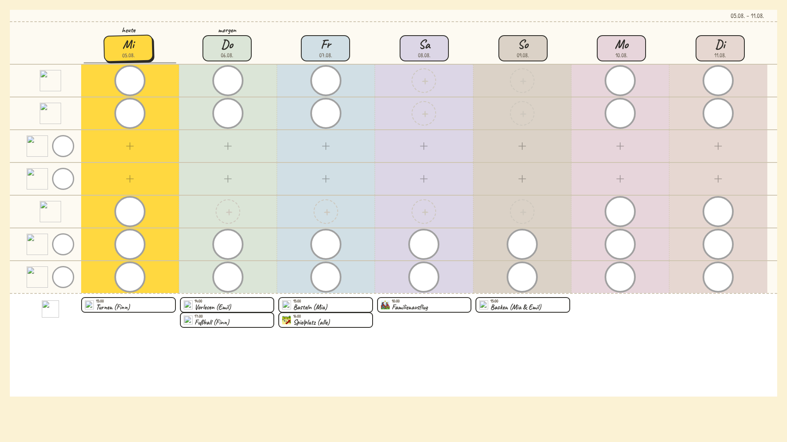
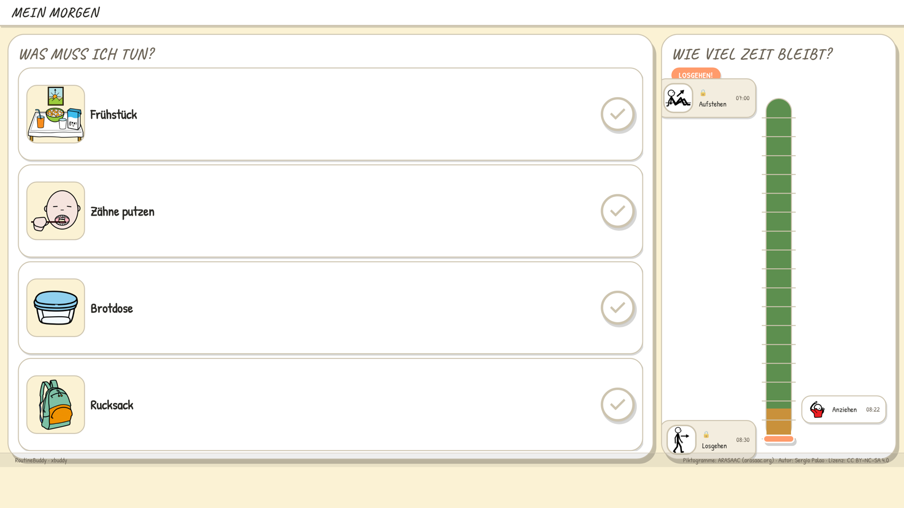
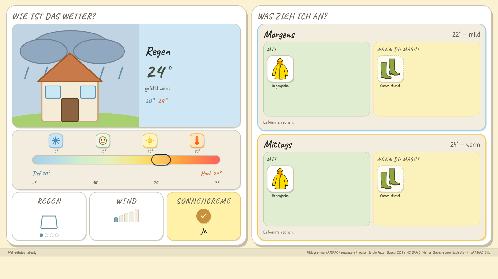
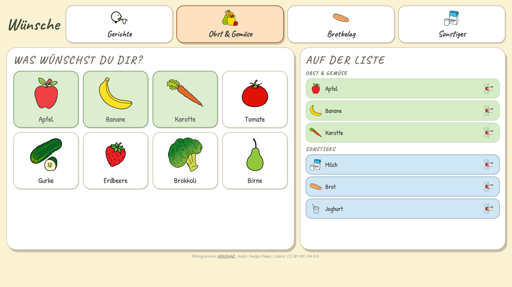
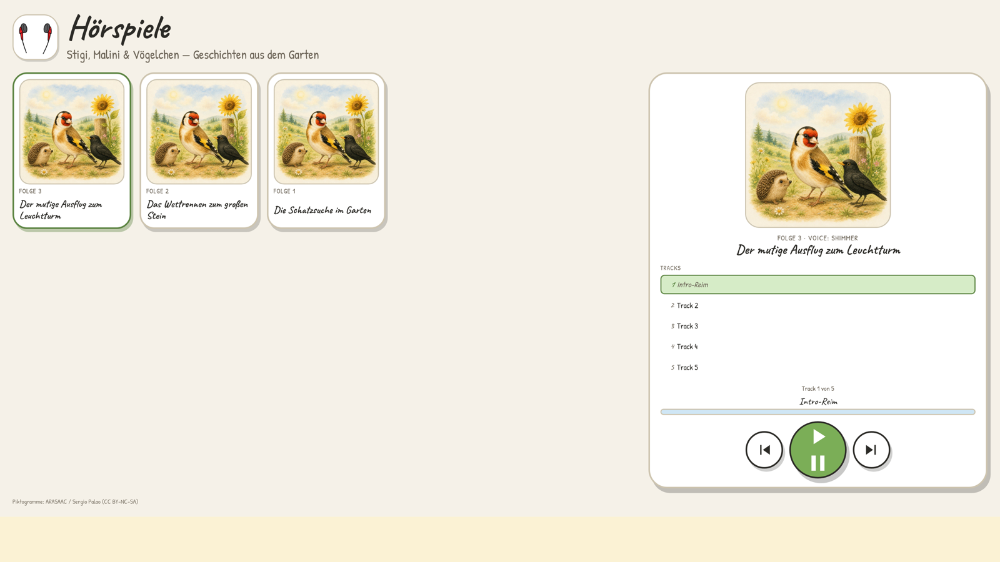
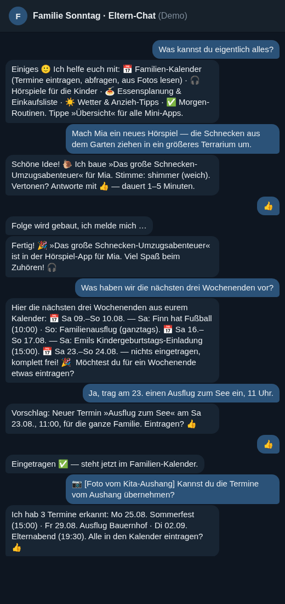
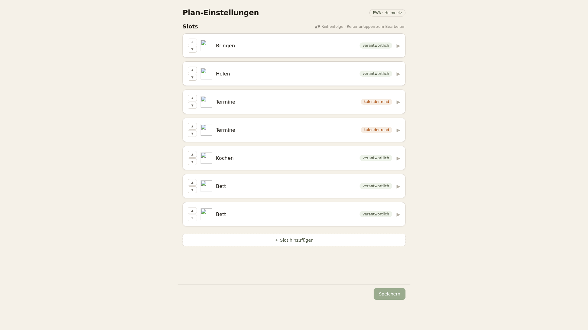
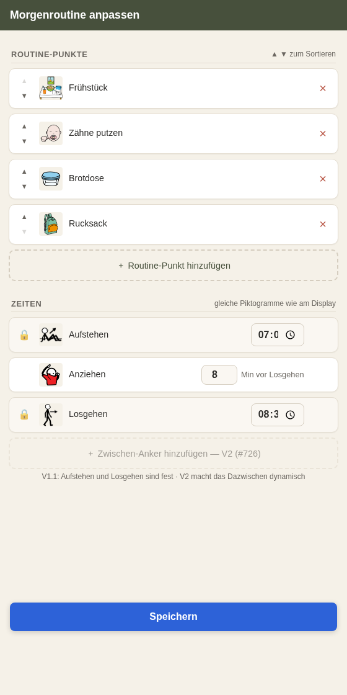
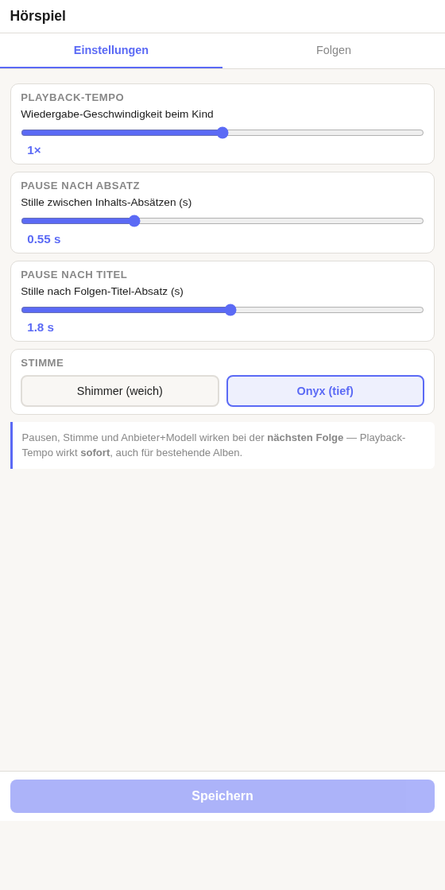

# XBuddy

*[Deutsche Fassung](README.de.md) · the family-facing UI is in German.*

### ▶︎ Live demo — **[xbuddy-demo-mobil.pages.dev](https://xbuddy-demo-mobil.pages.dev/)**

Seven cards that show in one minute what this is about — runs in the browser,
no sign-up.

---

**A self-hosted assistance system for families.** A child sees on the display
who picks them up today, what's for lunch and what to wear this morning — and
listens to their audio plays without asking a parent. Parents talk to the same
system through a Telegram chat and small web apps: "Put bread on the shopping
list", "Who picks up on Friday?".

**North Star.** XBuddy succeeds when a child can do something on their own that
used to require a parent. Every feature is measured against that: does it move
a task from the parent to the child — does it give self-efficacy back?

Everything runs on **your own hardware** (a Raspberry Pi is enough) and brings
in the devices the family already has instead of forcing new ones. AI sits
underneath as **infrastructure, not a feature** — the family doesn't experience
"AI", they experience the results.

## Screenshots

From the demo stack that ships with this repo (`tools/demo/run_stack.sh`) —
generic demo family **Sonntag**, no real family content.

**What children see** — full-screen displays, no menu, no login:

| | |
|---|---|
|  |  |
| Week plan — who picks up, what's on today | Morning routine — what do I need to do, how much time is left |
|  |  |
| Weather with clothing recommendation | Meal wishes — the child writes onto the shopping list themselves |
|  |  |
| Audio-play library | Photo frame |

**What parents see** — the chat and four small web apps on the phone:

| | |
|---|---|
|  |  |
| Parent chat in Telegram — the main interface | Shopping list |
|  |  |
| Setting up the week plan | Adjusting the morning routine |
|  | |
| Audio-play settings (speed, pauses, voice) | |

> All views + how to regenerate them: [`docs/screenshots/`](docs/screenshots/).
> The parent chat is an **invented** example transcript, not a real chat.

## Try it yourself — one command, no server needed

```
tools/demo/run_stack.sh          # seeds demo data + starts all views locally
                                 # → http://127.0.0.1:8199
```

Then open e.g. `/display/plan/woche`, `/display/hoerspiel/mia/alben` or the
parent apps at `/seiten/essen/einkauf/` and `/seiten/plan/einstellungen/`.
`Ctrl-C` tears everything down again.

The stack keeps its data in a **throwaway directory** `xbuddy-data-demo/` and
runs on ports from 8100 upward — a real instance on the same machine stays
untouched. Single screenshots: `tools/demo/shoot.sh /display/plan/woche`.

The parent-chat view is a Telegram bot and can't be shown as a web view; a
static example page stands in for it:
[`tools/demo/chat_transcript/eltern-chat-sonntag.html`](tools/demo/chat_transcript/eltern-chat-sonntag.html)
— just open it in the browser.

The pictograms come from [ARASAAC](https://arasaac.org) (CC BY-NC-SA 4.0 ·
Sergio Palao, [`NOTICE`](tools/demo/assets/icons/NOTICE)).

## How it is built

XBuddy is not a single-file app but several small services — one per
"buddy" (plan, routine, weather, meals, audio plays, photos …). Together they
form a **family instance**. Whatever differs from family to family lives in
configuration files outside of git; the code here is the template.

Quality attributes in priority order: **reliability** (a board that doesn't
show the plan in the morning is worse than no board), **simplicity**,
**privacy** (processing in Germany, anonymisation before data leaves the device
layer), **offline capability** and **non-invasive** (no push notifications, no
engagement design).

## From `git clone` to a running family

1. **Environment.** `pyproject.toml` is the single dependency source:

   ```
   python3 -m venv .venv
   .venv/bin/pip install .        # runtime dependencies
   .venv/bin/pip install pytest   # tests only
   ```

2. **Create the per-instance files.** Every family-specific file ships as a
   template `*.example.json` next to its service's code — copy and fill in:
   - `<service>/config.example.json` → `config.json` (bind host/port, log
     level, AI provider/model; every value can also be overridden via
     environment variable, e.g. `PLAN_LISTEN_PORT`)
   - data templates per service, such as `familie/familie.example.json` (who
     belongs to the family), `hoerspiel/hoerspiel.example.json`,
     `essen/wuensche.example.json`
   - the shared data directory comes from `XBUDDY_DATA_DIR`

3. **Secrets** (AI provider key, Google OAuth, Telegram bot token) do **not**
   belong in files or environment variables in plain text, but in the
   credentials store: [`tools/zugangsdaten`](tools/zugangsdaten/README.md).

4. **Start the services** — each buddy as its own process (`python3 -m
   <service>`, details in each directory). The `seiten` service serves the
   parent pages and the web apps.

## Where things live

- **[`AGENTS.md`](AGENTS.md)** — the entry map: what lives where and in which
  order to read it. Newcomers (human or AI agent) start there.
- **[`specs/`](specs/)** — living specs, the source of truth for behavior;
  [`constitution.md`](specs/constitution.md) holds the principles
- **[`conventions/`](conventions/)** — build rules across components
- **[`decisions/`](decisions/)** — ledger of architecture decisions: decided
  once, written down, not relitigated
- **[`WORKFLOW.md`](WORKFLOW.md)** — how tickets and PRs work ·
  **[`CLAUDE.md`](CLAUDE.md)** — working rules inside the repo
- **[`lotse`](https://github.com/niclaseschner-ship-it/lotse)** — the method
  XBuddy is built with, as its own public repo
  ([live demo](https://lotse-demo.pages.dev/))

## Tests & lint

```
make test      # python3 -m pytest -q   — repo-wide suite
make lint      # lint-imports           — module boundaries
make ruff      # uvx ruff@0.15.15 check — style lint
```

All three are CI gates too
([`pytest.yml`](.github/workflows/pytest.yml),
[`lint-imports.yml`](.github/workflows/lint-imports.yml),
[`ruff.yml`](.github/workflows/ruff.yml)). Whoever adds a new test suite
without registering it in `pytest.ini` is reminded by a guard test — no suite
silently drops out of the run.

## Contributing

Issues and PRs follow [`WORKFLOW.md`](WORKFLOW.md). No code without a
requirement ID in the spec — what that means is explained in
[`specs/README.md`](specs/README.md).
